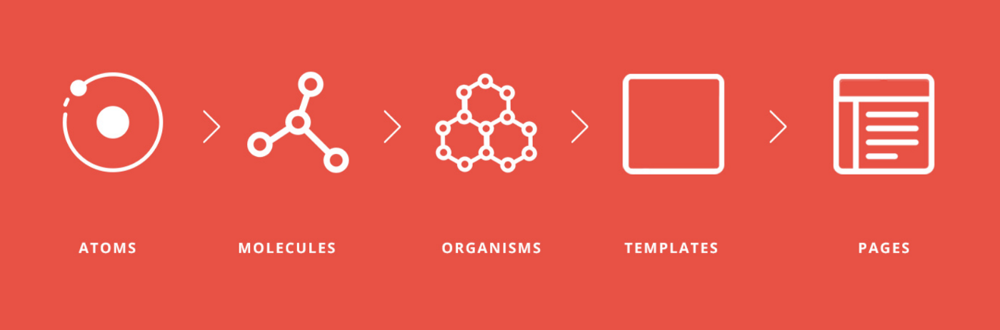

# react-atomicdesignpattern
Atomic Design Pattern Example for ReactJS Application

Atomic design, developed by Brad Frost and Dave Olsen, is a methodology for crafting design systems with five fundamental building blocks, which, when combined, promote consistency, modularity, and scalability. In this post, we’re going to explore how these principles are a natural fit for building interfaces in React, and how we can extend the Atomic metaphor in useful ways such that we can map out components which have a dynamic lifecycle inside of an abstract ecosystem.

The five distinct levels of atomic design — atoms > molecules > organisms > templates > pages — map incredibly well to React’s component-based architecture.

Atoms:

Basic building blocks of matter, such as a button, input or a form label. They’re not useful on their own.

Molecules:

Grouping atoms together, such as combining a button, input and form label to build functionality.

Organisms:

Combining molecules together to form organisms that make up a distinct section of an interface (i.e. navigation bar)

Templates:

Consisting mostly of groups of organisms to form a page — where clients can see a final design in place.

Pages:

An ecosystem that views different template renders. We can create multiple ecosystems into a single environment — the application.

File Structure

Since React follows a component-based architecture, it’s pretty common to organise your components based on the type, rather than feature. What if we built a sub-ecosystem for each component feature?

Each component or service has its own isolated environment — everything needed to work on its own instance. You can see that each component /Buttons & /Form has its own set of styles, actions, and unit or integration tests that act like an independent piece of feature in your app. (You can also add its own set of images and other local variables.) This makes it much easier, and reduces your efforts, to test your code consistently and effectively.

This type of organisation allows for nesting components into another component. Note that if you define a new component inside /Delete, /Submit, /Login, or /Register, the nested component can only be used by its direct parent, and not its cousins.
