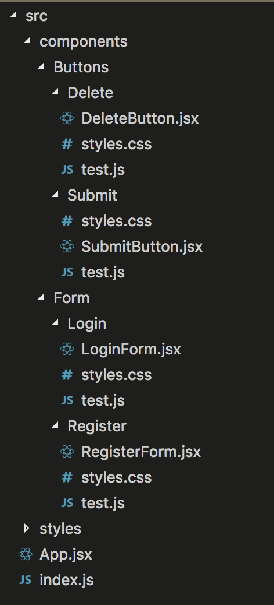

Atomic design, developed by Brad Frost and Dave Olsen, is a methodology for crafting design systems with five fundamental building blocks, which, when combined, promote consistency, modularity, and scalability. Based on React's declarative style of building UIs these principles are a natural fit for building interfaces in React. ![https://atomicdesign.bradfrost.com/chapter-2/]

The five distinct levels of atomic design — atoms > molecules > organisms > templates > pages — map incredibly well to React’s component-based architecture.

## Atoms:

Basic building blocks of matter, such as a button, input or a form label. They’re not useful on their own.

## Molecules:

Grouping atoms together, such as combining a button, input and form label to build functionality.

## Organisms:

Combining molecules together to form organisms that make up a distinct section of an interface (i.e. navigation bar)

## Templates:

Consisting mostly of groups of organisms to form a page — where clients can see a final design in place.

## Pages:

An ecosystem that views different template renders. We can create multiple ecosystems into a single environment — the application.

# File Structure

Since React follows a component-based architecture, it’s pretty common to organise your components based on the type, rather than feature. What if we built a sub-ecosystem for each component feature?

1. Each component or service has its own isolated environment — everything needed to work on its own instance. You can see that each component /Buttons & /Form has its own set of styles, actions, and unit or integration tests that act like an independent piece of feature in your app. (You can also add its own set of images and other local variables.) This makes it much easier, and reduces your efforts, to test your code consistently and effectively.

1. This type of organisation allows for nesting components into another component. Note that if you define a new component inside /Delete, /Submit, /Login, or /Register, the nested component can only be used by its direct parent, and not its cousins.

## React + Atomic Design
When we started to use Atomic Design within React we had to adjust some rules of the methodology to ensure that components were reused as much as possible, that they were stateless, without styles of positions and very specific margins so to avoid any side effects in the pages of application.

So with each new component we asked ourselves: “Are these components generic enough to avoid specificity and/or repeated code in whatever context they are used?”

So we were able to write a few rules:

- The Atomic Design should have a file of variables and it must be imported by each component;
- The atoms should be written without margins and positions;
- Only the molecules and organisms can set the positions of atoms, but these stacks can’t have any styles of margins and positions;
- Templates have only one function: to set the grid of pages but never positions of specific components;
- Pages render the components with a template defined and it’s here that the Atomic Design will be connected to the rest of the application;

## Scripts

| Script | Desc |
| ---- | ---- |
|`$ yarn start`| Start a simple webpack server |
|`$ yarn dev`| Create a server to development at port 5000 |
|`$ yarn storybook`| Start Storybook with the stories imported |
|`$ yarn flow`| Validate the flow types |

## Libraries

- Webpack
  - CSS Loader
  - SVG Sprite loader
  - File loader 
- Flow types
- Storybook
  - Storybook Info
- CSS
  - Autoprefixer
  - Import
  - Nested
  - Variables
  - Inline SVG
- Babel
  - Loader
  - Preset ES2015
- Project
  - Atomic Design styles folder structure
  - ESLint
  - Prettier

## Contributors
[@danilowoz](https://github.com/danilowoz/)

[@dleitee](https://github.com/dleitee/)

### License
MIT

